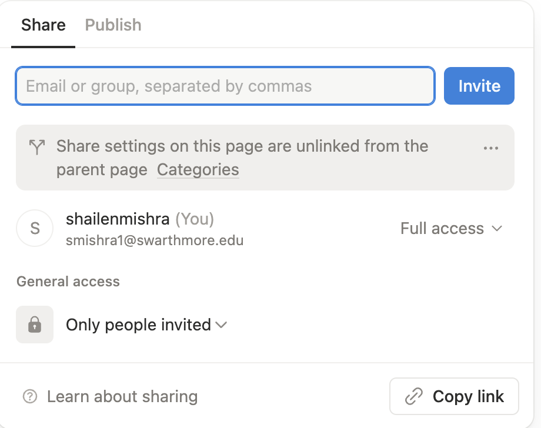

# Project 3 - Style in Academic Space
{: .no_toc }

The third project of English 2W focuses on how to demonstrate a writing style in academic writing contexts. Details about the project, deadlines, and point distribution are shared in this handout.

{: .note }
> This is a working document. I will be adding content to it and/or tweaking the existing content, as my thought evolves on these assignments and as our discussion on rhetoric becomes more clarifying for me. The idea is to make the assignment expectations clearer to you and more relevant to the course. 

  

    Table of Contents
  

- TOC
{:toc}

## Project Description
For this project, readings will include academic texts from different disciplines; students will analyze the role of style in these texts and how academics/researchers demonstrate their style alongside the expectations of their discipline. The project will culminate in an academic text of 2000 words or more with considerable experimentation in style. Students are expected to include multimodal contents (audio, video, charts, etc.) in their essay and use the Notion.so template provided to them to draft and publish their work on the internet. 

Grade points: 30% 

## Project Expectations
- The minimum word count of your final draft needs to be 2000. You can go over the word limit.
- You’re encouraged to use multimedia content (like images, video, graphs) in your essay. Please add a caption below the multimedia content and mention the source.
- You’re required to use at least 10 credible sources. At least 3 of them need to be peer-reviewed scholarly sources. To know more about the difference between popular and scholarly sources, check this page titled “[Scholarly and Popular Sources](https://guides.lib.berkeley.edu/c.php?g=83917&p=3747680)” from UC Berkeley’s library.
- You can use MLA or APA citation style in your paper. Make sure that you add both in-text citations AND a properly formatted bibliography. By in-text citation I mean the sources you mention in the body of your essay in parenthesis and bibliography is the “Works Cited” or “References”section at the end of your paper. For MLA citations, use [this guide](https://libguides.umgc.edu/mla-examples#volume). For APA citations, use [this guide](https://libguides.umgc.edu/apa-examples).

## How to Get Started with the Project?
- Start with a topic idea that you're passionate about. Questions to ask are: why do you want to write about this topic? What's unique and important about it? Who is the audience for it? What kind of specific and urgent argument can you provide on your topic? Check the "Topic Proposal" and "Outline" expectations below.
- Once you've an inkling of a topic idea, start conducting research into your topic, the disciplinary expectations of your text, and the multimodal contents you might incorporate.
- Develop an outline for your text and submit it to Moodle.  
- Proceed to compose your rough draft on Notion.so, using the project 3 template provided to you. 
- As far as submitting and sharing your Rough Draft is concerned to receive feedback,
	- Please follow the instructions as per the section "[Share [your work] with one person](https://www.notion.com/help/share-your-work#share-with-one-person)". You'll give full access to me and your peer reviewer by using our Swarthmore email ID.
	- Also use the "Copy link" option to copy the link to your draft and upload that link to Moodle for easy access by me and your peer reviewer
	  
- Get feedback from your instructor, peers, and Writing Associate (WA). 
- Revise and finalize your draft. The final draft should be published on the web. Follow the instructions on this page: "[Share with the web](https://www.notion.com/help/share-your-work#share-with-the-web)." Copy the published link and submit it to Moodle.

## Drafting and Grade Distribution
 Total grade points: 30%, which is divided as follows: 
 
 - **Topic proposal**: You’re required to pitch your topic idea to me in the form of a research question. In the Discussion Forum in Moodle, you’ll post your topic proposal and a brief explanation of what draws you to this topic and who the potential audience is. I will work with you to ensure that your research question is focused and has enough scope for rigor. Submit to Moodle by **April 8**. Grade points: 2%.
- **Preliminary Research**: Time to conduct research on your research question and share your research progress. You should submit six credible sources at this stage and two of them need to be peer-reviewed scholarly sources. Submit to Moodle by **April 12**. Grade points: 3%.
- **Outline**: Submit an outline for your essay by **April 15**. Grade points: 4%. What I am looking for in this outline is: 
	- a) What's special about your topic? Meaning, what's the exigency around which your essay is built? You'll need to brainstorm more on this area, as this is the crucial first step to ensuring that you get clarity and purpose in exercising style.
	- b) Who is the audience? What academic group or subgroup for which this essay is targeted?
	- c) What will be the structure of your essay? Meaning, the outline will lay out the overall organization of your content.
	- d) What sort of multimodal content will go into the essay?
- **Rough Draft**: The Rough Draft should be at least 1,600 words long. The emphasis will be on the thrust of your idea, performance of style,  preliminary research, audience awareness and rhetorical skills (the broader writing goals) than grammatical correctness or citation. However, a Rough Draft submitted with many typos may face a penalty. The grade points for the rough draft will be combined with the Final Draft. You will get feedback from me on your Rough Draft through individual conferences. Compose your work on Notion's template provided to you, share your draft as per the instructions provided above, and submit the link to your draft to Moodle by **April 19**.
- **Peer Feedback**: Please provide feedback to one of your peer's rough drafts. Your grade on Peer Feedback will be determined by the quality and the detailed nature of your feedback. Please use the peer review questionnaire provided to you. Submit to Moodle by **April 22**. Grade points: 4%. 
- **Final Draft**: Final Draft should be at least 2000 words long. Additionally, the draft should meet the expectations of the project listed above. The final work should be a published piece on the Notion. You'll submit to Moodle the published link by **May 6**. Grade points: 15%.
- **Audio recording**: Along with your final draft, submit a 2-minute audio recording of you reading out loud a part of your final draft. Choose a part of the final draft that is the most representative of your style. Submit the recording as a media file to Moodle by **May 6**. Grade points: 2%.

## Learning Outcomes
For each project, I have a vision of the skills you’ll develop, which aligns with the learning outcomes for the course outlined in the syllabus. You will reflect on these outcomes as the project nears completion.

- *Reading Skills*: What ways was your reading approach different for this project? Which assigned reading stimulated your interest the most and in what ways? How did the readings help you develop awareness on style?
- *Writing skills*: What new writing skills did you learn or acquire? What ways did your mental and emotional approach, voice, and style for the project vary? In what ways did you become aware of your writing process? How did the drafting and peer review process impact your own writing process?
- *Metacognition*: After completing this assignment, what strengths and weaknesses have you realized about yourself as a writer? What stylistic aspects do you plan to hone further in future? What writing skills will transfer to future writing situations in your discipline?
- *Rhetorical knowledge*: Who is the audience for this genre? What sort of audience knowledge is required? What’s the purpose of this genre? Which social, political, and cultural contexts does this writing apply to? How did you apply ethos, logos, and pathos to make your argument more persuasive?
- *Multimodal literacy*: What multimodal content (audio, visual, etc.) did you read or research for this project? What multimodal content did you incorporate in your writing? How did the multimodal content choices enrich the persuasive appeal of your essay?
- *Research*: How did your research process diverge (if at all) for this project? What new research strategies did you learn? How did you evaluate a source and establish its credibility and usefulness for your topic? How did you find and distinguish between scholarly and popular sources?
- *Open-mindedness and critical thinking*: What ways were you able to challenge normative thinking in the academic genre through your style?

## Student Questions
I expect you to have questions for me about the project. I'll populate this section with your questions and my responses. 
