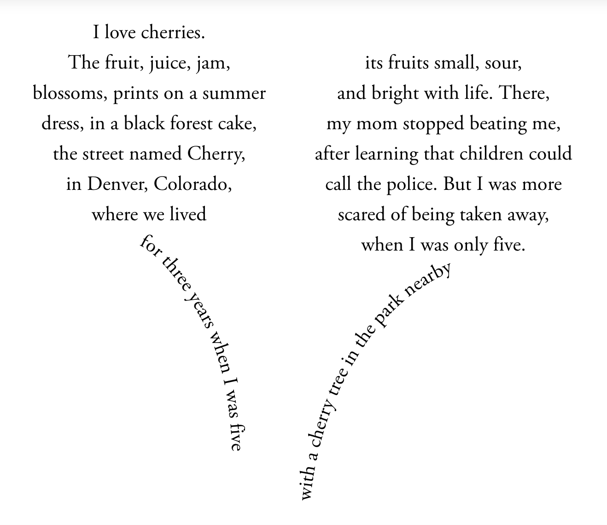

# Style, Social Media, Digital  and Multimodal Writing 

Feb 23, 2026

---

## Juxtaposition as a stylistic and rhetorical device 
>**Paul Butler**: [David Foster] Wallace achieves the effect of highlighting opposition through juxtaposing antithetical elements: a normally regular “grid” rendered “cockeyed”; streets that intersect in divergent directions (“north-south”; “northeast-southwest”); the blending of “slanted-cruciform corners.” Through the irregular structure of the essay and the constant shifts in form, he implies a process of constant upheaval, in both the landscape and himself.

Here we return to the refrain we talked about at the start of the semester: *form is substance and substance is form*.

---

## Form and structure as style
Editor A. C. Fifield's rejection letter to Gertrude Stein:

> Dear Madam, I am only one, only one, only one. Only one being, one at the same time. Not two, not three, only one. Only one life to live, only sixty minutes in one hour. Only one pair of eyes. Only one brain. Only one being. Being only one, having only one pair of eyes, having only one time, having only one life, I cannot read your M.S. three or four times. Not even one time. Only one look, only one look is enough. Hardly one copy would sell here. Hardly one. Hardly one.

---

## Inductive style example
> **Hunter S. Thompson**: It was just before midnight when I left Cambridge and headed north on U.S. 93 toward Manchester—driving one of those big green rented Auto/Stick Cougars that gets rubber for about twenty-nine seconds in Drive, and spits hot black divots all over the road in First or Second . . . a terrible screeching and fishtailing through the outskirts of Boston heading north to New Hampshire, back on the Campaign Trail . . . running late, as usual: left hand on the wheel and the other on the radio dial, seeking music, and a glass of iced Wild Turkey spilling into my crotch on every turn.

Drawing the reader in a descriptive, anecdotal, and intuitive level.

---

## Deductive style example
> **Stephen Hawking**: Aristotle believed that all the matter in the universe was made up of four basic elements—earth, air, fire, and water. These elements were acted on by two forces: gravity, the tendency for earth and water to sink, and levity, the tendency for air and fire to rise. This division of the contents of the universe into matter and forces is still used today.

Drawing the reader in with logical explanation, definition, and sequential thinking.

---

## Shape as style
>**Paul Butler**: What, then, can we say about how shape works in a writer’s style? As [Edward Santos] Garza shows, there is often a close relationship between style and meaning, with shape serving as a kind of arbiter, a control mechanism for merging ideas with form, style with meaning. Even if a writer does not consciously think about the shape of their work, the Wallace excerpt reveals that shape is at work under the surface. If we search for it, we can detect shape at work in writing styles.

---

## Poem "Cherry" by Yi Li

---

## Prepositional because
> **Paul Butler**: Megan Garber (2013), in an Atlantic article, “English Has a New Preposition, Because Internet,” gives another example, “I’m late because YouTube,” and quotes Stan Carey, a writer on language, as saying, “‘“Because” has become a preposition, because grammar.’” As is happening more and more often now in these phrases, an elliptical, or shortened, style emerges, with abridged, even incomplete, phrases taking the place of full, or grammatically correct, explanations.

---

## I can't even
> **Paul Butler**: Like prepositional because, the phrase I can’t even often captures thought in a kind of sentence fragment. It is based on the classical trope of aposiopesis, “becoming silent,” or stopping suddenly in midcourse without finishing a statement. Richard Lanham argues it is “sometimes from genuine passion, sometimes for effect.”

---

## Twitter and hashtags
> These constraints can be useful in learning to write concisely, highlighting the importance of every word in constructing a tweet. In addition, the use of hashtags, and the addition of the symbol # to classify or categorize the accompanying tweet, has contributed to the overall meaning of tweets.

---

## Style by imitation
> **From the article "What's that Bug?"**: Public outreach continues to be a top method for early detection and management. Many states have come up with unforgettable slogans and eye-catching posters to turn everyone into a lanternfly hero. New Jersey wants you to "Join the battle. Stomp it out!" Pennsylvania uses, "Look before you leave!" to remind residents to check their vehicles for clingy pests. And Maryland has employed a more humorous approach — "Wanted" posters with photos of the bug in all life stages.

---

## "What's that bug?" article

#### What are the multimodal and/or interactive elements of the piece that might be impacting or influencing the style of the piece? 

- Color of the page feels intentional that matched with the color on the bug --> how the color has more stickiness to it and it lurks in your mind and imagination longer
- How the map communicated how prevalent the issue is? --> Deeper sense of space and time
- To have the bug crawling at the top of the page a visual and sensory messaging --> what it feels to come up-close with this bug
- Helped to have the map move --> stylistically effective because one can read it and visualize it

---

## "What's that bug?" article

#### What are the multimodal and/or interactive elements of the piece that might be impacting or influencing the style of the piece? 

- How the actionable items section as a list works? --> a clearer sense of what to do? Does that visual aid help with clarity and urgency?  
- What about the change of background in the section about zebra mussels? How that background matches with the color of zebra mussels' stripes?
- Wondering if this page is accessible; how a person with visual disability will interact with this piece
- Can the scrolling itself be a distraction? Why not quiet down? Is it just "cool" stuff?
